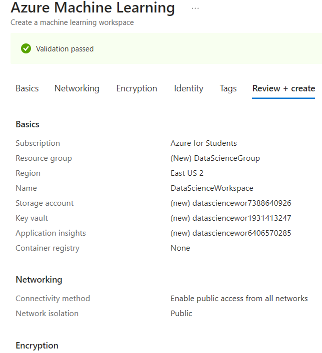
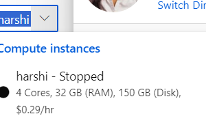
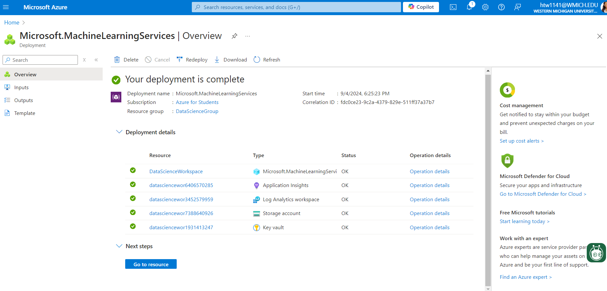

# Player Performance Prediction using Machine Learning

This project focuses on building a predictive model that analyzes player performance using advanced machine learning techniques. The methods and approaches described can be adapted across various sports, including basketball, baseball, and football, to evaluate player potential, improve scouting strategies, and optimize team management decisions.

## Project Overview

The primary objective of this project is to apply machine learning algorithms to predict player performance based on historical data. This can help teams make data-driven decisions regarding player acquisitions, team composition, and performance optimization.

## Technologies Used
- **Azure Machine Learning**: For model development and deployment.
- **VS Code**: For writing and debugging code.
- **Python**: Main language for data analysis, machine learning, and web scraping.
- **Jupyter Notebooks**: For interactive coding and model experimentation.
- **Power BI**: For data visualization and reporting.
- **GitHub**: For version control and collaboration.
- **Web Scraping (Python, pandas, url requests)**: For gathering data from various sources.

## Steps Followed in the Project

### 1. Data Collection and Preprocessing
- Gathered player statistics and performance metrics from multiple sources (internal databases, APIs, web scraping)d.
- Cleaned and preprocessed the data using pandas and NumPy.

### 2. Azure Machine Learning Workspace Setup
- Created an Azure ML Workspace.
  
  

- Configured necessary resources (Storage Account, Key Vault, etc.).

  

- Launched compute instances to run experiments and models.

  

### 3. Model Development
- Used several machine learning techniques such as:
  - K-Nearest Neighbors (KNN)
  - Random Forest
  - Gradient Boosting Machines (GBM)
  - XGBoost
- Fine-tuned hyperparameters using Grid Search and Randomized Search.

### 4. Model Evaluation
- Evaluated the performance of each model using accuracy, precision, recall, and F1-score.
- Visualized the model performance and results in Jupyter Notebooks and Power BI.

### 5. Deployment
- Deployed the best-performing model using Azure ML for real-time predictions.
- Set up APIs for easy access to the predictions and integration with other systems.

  

## Files in the Repository

- **Data_Science.ipynb**: Jupyter Notebook with the entire workflow of data analysis and model building.
- **player_stat.csv**: Dataset of player statistics used for the analysis.
- **Azure_ML_Workspace_creation.png**: Steps for creating Azure ML Workspace.
- **Compute.png**: Screenshot showing compute instance configuration.
- **Deployment_Completion.png**: Screenshot showing successful deployment of the model.
- **README.md**: This file, describing the project and the process.

## How to Run the Project

1. Clone the repository:
   ```bash
   git clone https://github.com/harshithach999/Player-Performance-Prediction.git
   cd Player-Performance-Prediction
